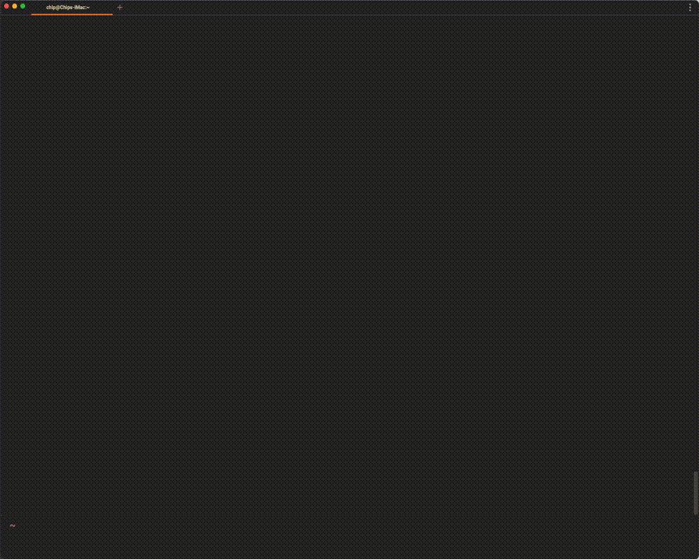

# telescope-software-licenses.nvim



This [telescope.nvim](https://github.com/nvim-telescope/telescope.nvim)
extension allows you to view common software licenses and paste them into a buffer.

Currently supports the following licenses:
* [gpl-1.0: GNU General Public License (GPL)](https://www.gnu.org/licenses/gpl-1.0.html)
* [gpl-2.0: GNU General Public License (GPL)](https://www.gnu.org/licenses/gpl-2.0.html)
* [gpl-3.0: GNU General Public License (GPL)](https://www.gnu.org/licenses/gpl-3.0.html)
* [lgpl-2.0: GNU Lesser General Public License (LGPL)](https://www.gnu.org/licenses/)
* [lgpl-2.1: GNU Lesser General Public License (LGPL](https://www.gnu.org/licenses/lgpl-2.1.html)
* [lgpl-3.0: GNU Lesser General Public License (LGPL](https://www.gnu.org/licenses/lgpl-3.0.html)
* [agpl-3.0: GNU Affero General Public License (AGPL)](https://www.gnu.org/licenses/agpl-3.0.html)
* [fdl-1.1: GNU Free Documentation License (FDL)](https://www.gnu.org/licenses/fdl-1.1.html)
* [fdl-1.2: GNU Free Documentation License (FDL)](https://www.gnu.org/licenses/fdl-1.2.html)
* [fdl-1.3: GNU Free Documentation License (FDL)](https://www.gnu.org/licenses/fdl-1.3.html)

## Requirements

- Neovim (v0.6.0)
- [telescope.nvim](https://github.com/nvim-telescope/telescope.nvim) (required)
- *Only tested on MacOS 11.6.1*

## Install

You can install the extension by using your plugin manager of choice or by
cloning this repository somewhere on your filepath, and then adding the
following somewhere after telescope in your configuration file (`init.vim` or
`init.lua`).

### Using [Paq](https://github.com/savq/paq-nvim)
```lua
require "paq" {
  "nvim-lua/plenary.nvim";
  "nvim-telescope/telescope.nvim";
  "chip/telescope-software-licenses.nvim";
}
require("telescope").load_extension("software-licenses");
```

### Using [packer.nvim](https://github.com/wbthomason/packer.nvim)
```lua
use "nvim-lua/plenary.nvim"
use "nvim-telescope/telescope.nvim"
use "chip/telescope-software-licenses.nvim"
require("telescope").load_extension("software-licenses")
```
## Setup

### Commands

```vim
" Prompts user for Github user/repo
" Prompts for file argument, but uses README.md as default
:Telescope software-licenses find
```

### Bind to Keys:

```vim
" Replace <Leader>sl with whatever you prefer
nnoremap <Leader>sl :Telescope software-licenses find<CR>
```

### Development

```zsh
$ git clone git@github.com:chip/telescope-software-licenses.nvim.git
$ cd telescope-software-licenses.nvim/lua/telescope/_extensions
```
See [plugin/dev.vim](https://github.com/chip/telescope-software-licenses.nvim/blob/master/lua/telescope/_extensions/plugin/dev.vim) for details.
